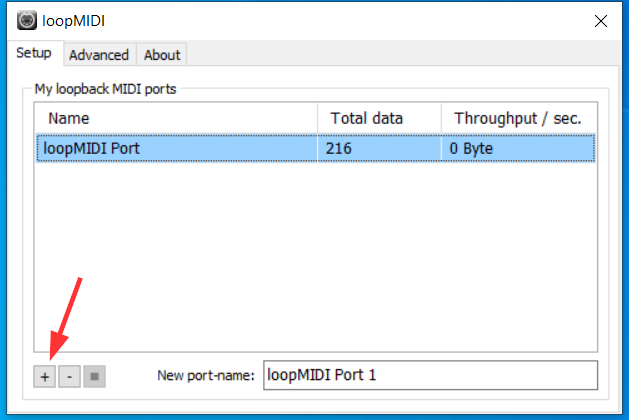
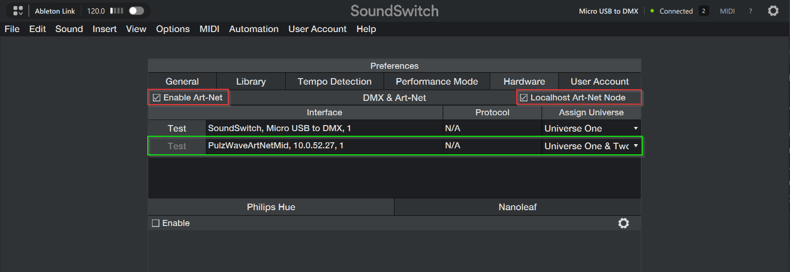
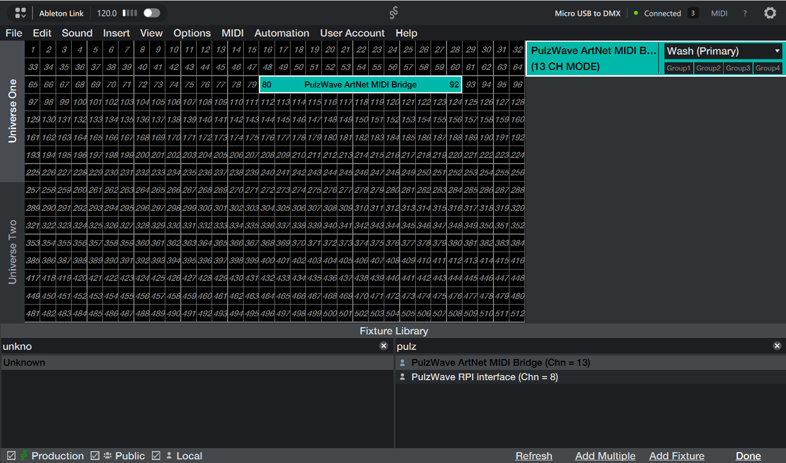

# PulzWaveArtNetMidiBridge

**Art-Net to MIDI Bridge** - Convert DMX lighting data to MIDI for visual synchronization.


## Features

- 🎨 **DMX to MIDI Conversion** - Converts RGB, White, UV, and Intensity channels to MIDI CC
- 🌈 **Color Analysis** - Extracts Hue from RGB for color-reactive visuals
- 🎹 **Note Triggers** - DMX attribute channel triggers MIDI notes
- ⚡ **Strobe Support** - Simulates strobe effects via intensity modulation
- 🖥️ **Cross-Platform** - Works on Windows and macOS support is planned
- 🎛️ **Real-time Monitor** - Visual feedback of all DMX and MIDI values

## Installation

### From Source

```bash
# Clone the repository
git clone https://github.com/pulzwave/PulzWaveArtNetMidiBridge.git
cd PulzWaveArtNetMidiBridge

# Create virtual environment
python -m venv .venv

# Activate (Windows)
.venv\Scripts\activate

# Activate (macOS/Linux)
source .venv/bin/activate

# Install dependencies
pip install -r requirements.txt
```

### Running

```bash
python -m src.main
```

## DMX Channel Layout

Starting from the configured start channel:

| Offset | Channel | Description |
|--------|---------|-------------|
| +0 | Red | RGB Red (0-255) |
| +1 | Green | RGB Green (0-255) |
| +2 | Blue | RGB Blue (0-255) |
| +3 | White | White (0-255) |
| +4 | UV | UV/Blacklight (0-255) |
| +5 | Dimmer | Master Intensity (0-255) |
| +6 | Strobe | Strobe Speed (0-255) |
| +7 | Attribute | Note Trigger (0-255) |
| +8 | Hold | Note Hold Time (0=continuous, 1-255=0-10s) |

### Hold Time Channel

- **Value 0**: Note is held continuously until the attribute changes
- **Value 1-255**: Note is held for a duration mapped to 0-10,000ms (10 seconds)
  - Example: Value 127 ≈ 5 seconds hold time
  - Example: Value 255 = 10 seconds hold time

## MIDI Output

### Control Changes (CC)

| CC | Parameter | Range |
|----|-----------|-------|
| 10 | Red | 0-127 |
| 11 | Green | 0-127 |
| 12 | Blue | 0-127 |
| 13 | White | 0-127 |
| 14 | UV | 0-127 |
| 15 | Intensity | 0-127 |
| 16 | Hue | 0-127 |
| 17 | Inverse Hue | 0-127 |

### Notes

- Attribute channel value 1-127 triggers MIDI notes 12-138 (C0 onwards)
- Notes are automatically released when attribute changes

## Configuration

Settings are stored in:
- **Windows**: `%APPDATA%\PulzWave\PulzWaveArtNetMidiBridge\config.json`
- **macOS**: `~/Library/Application Support/PulzWaveArtNetMidiBridge/config.json`

### First-Time Setup

On first launch, the app displays a setup wizard that guides you through:
1. **DMX Configuration** - Set Art-Net universe and start channel
2. **MIDI Output** - Select your MIDI output device
3. **Connection Test** - Verify Art-Net connectivity

## loopMIDI Setup (Windows)

PulzWaveArtNetMidiBridge requires a virtual MIDI port to send MIDI to other applications. We recommend [loopMIDI](https://www.tobias-erichsen.de/software/loopmidi.html) (free).

1. Download and install loopMIDI
2. Launch loopMIDI
3. Click the **+** button to create a new virtual MIDI port
4. The port will appear in the list and can now be selected in PulzWaveArtNetMidiBridge



## SoundSwitch Setup

To use PulzWaveArtNetMidiBridge with [SoundSwitch](https://www.soundswitch.com/), you need to configure Art-Net output and add the fixture.

### Enable Art-Net

1. Open SoundSwitch **Preferences**
2. Go to the **Art-Net** section
3. Enable **Art-Net** output
4. You should see the **PulzWaveArtNetMIDI** interface in the list (make sure the app is running)



> **Note:** If the PulzWaveArtNetMIDI interface doesn't appear, make sure PulzWaveArtNetMidiBridge is running and listening on the correct network interface.

### Add the Fixture

1. Go to **DMX Setup**
2. Click **Add Fixture** 
3. Search for manufacturer: **Unknown**
4. Select fixture: **PulzWave ArtNet MIDI Bridge**
5. Add it to your DMX profile and assign it to the desired universe/channel



> **Note:** Make sure the Art-Net universe and start channel in SoundSwitch match the settings configured in PulzWaveArtNetMidiBridge.

## Laser Software Integration

### Pangolin QuickShow

PulzWaveArtNetMidiBridge works great with Pangolin QuickShow for lighting-synchronized laser shows.

📖 **[See the QuickShow Setup Guide →](docs/QuickShow_Setup.md)**

The guide includes animated demos showing:
- How to configure MIDI mapping using the LEARN button
- What the live synchronization looks like in action

## Building Executables

### Windows

```bash
pyinstaller build_scripts/windows.spec
```

### macOS

```bash
pyinstaller build_scripts/macos.spec
```

## Project Structure

```
├── .github/workflows/    # CI/CD pipelines
├── build_scripts/        # PyInstaller specs
├── src/
│   ├── __init__.py
│   ├── main.py           # Entry point
│   ├── config.py         # Settings manager
│   ├── ui.py             # NiceGUI interface
│   ├── setup_wizard.py   # First-time setup wizard
│   ├── texts.json        # UI texts for easy localization
│   ├── artnet_listener.py# UDP Art-Net receiver
│   └── midi_manager.py   # MIDI output handling
├── requirements.txt
└── README.md
```

## License

MIT License - See LICENSE file for details.

## Support

☕ [Buy me a coffee](https://buymeacoffee.com/pulzwave)

---

Made with ❤️ by [PulzWave](https://github.com/pulzwave)
