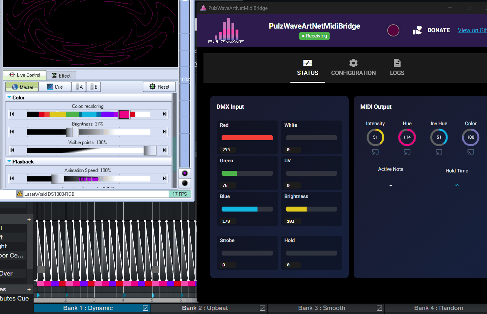

# QuickShow MIDI Setup Guide

This guide shows you how to configure [Pangolin QuickShow](https://pangolin.com/products/quickshow) to receive MIDI from PulzWaveArtNetMidiBridge.

## Prerequisites

Before starting, make sure:
- ✅ loopMIDI is installed and running with a virtual port created
- ✅ PulzWaveArtNetMidiBridge is running and connected to the loopMIDI port
- ✅ SoundSwitch is sending Art-Net data

## Step 1: Configure MIDI Device in QuickShow

1. Open QuickShow
2. Go to **Settings → MIDI → MIDI Settings**
3. Select **loopMIDI Port** as your MIDI input device

## Step 2: Set Up MIDI Mapping

1. Go to **Settings → MIDI → MIDI to Live Control**
2. For each control you want to map:
   - Click the **LEARN** button next to the parameter
   - Trigger the corresponding DMX channel in SoundSwitch
   - **Important:** Select **Slider** as the controller type (not Encoder)

### MIDI Mapping Demo

The animation below shows the complete MIDI mapping process using the LEARN button:

## Live Demo

Once everything is configured, your QuickShow should react to the DMX data coming from SoundSwitch. Here's what it looks like with an autoloop running:

## Troubleshooting

- **No MIDI signal?** Make sure loopMIDI is running and the virtual port is created
- **QuickShow not responding?** Check that you selected the correct loopMIDI port in MIDI Settings
- **Values jumping erratically?** Make sure you selected **Slider** instead of **Encoder** as controller type

---

[← Back to main documentation](../README.md)
